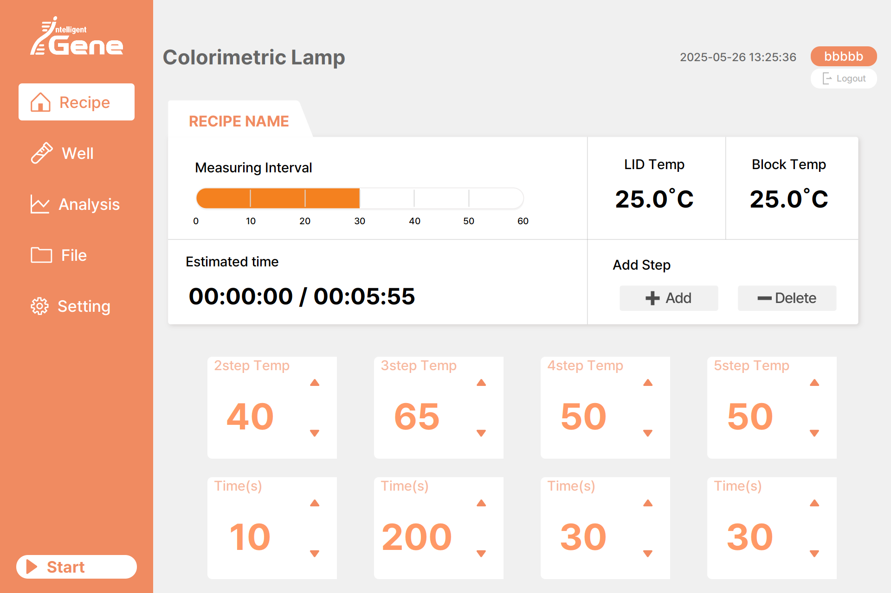
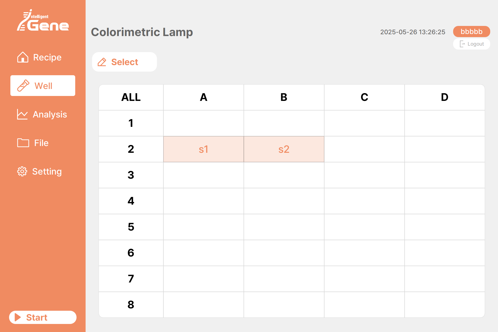
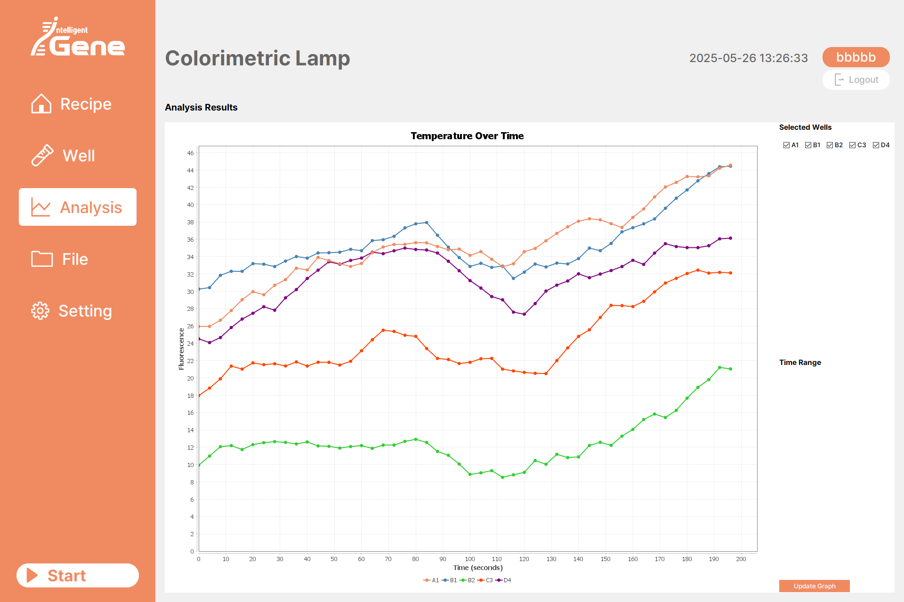
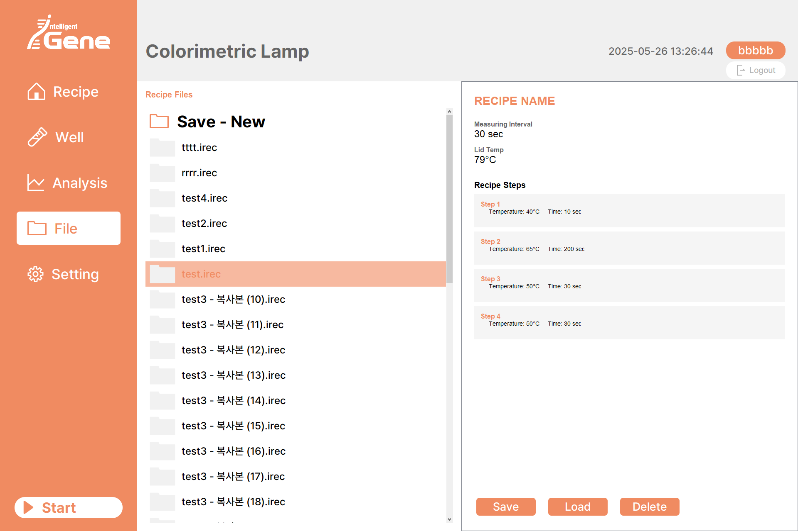

# Colorimetric Lamp PCR 제어 시스템 (Firmware + GUI)

이 프로젝트는 **PCR 결과를 시약의 색변화로 탐지하는 장비**인 `Colorimetric Lamp PCR`의 소프트웨어 및 펌웨어 제어 시스템입니다.

## 시스템 개요

- **GUI 플랫폼**: Java + 라즈베리파이 기반
- **펌웨어 플랫폼**: ATmega328 (C 기반)
- **통신 방식**: UART (시리얼)
- **프로젝트 역할**:
  - GUI: 100% 개발 참여
  - 펌웨어(C): 100% 개발 참여
  - 디자인: 디자인팀 담당

## 주요 기능
- 듀얼 히터 PID 제어 (Block / Lid)
- 자동 팬 제어 및 온도 상승률 감시
- 오토튜닝 기반 파라미터 조정 기능
- 실시간 온도 모니터링 및 시각화
- 사용자가 직접 제어 가능한 시리얼 명령어 인터페이스
- 분석 결과를 색변화 기반으로 출력 및 관리

## 스크린샷

| 메인 레시피 설정 | Well 설정 | 분석 화면 | 파일 관리 |
|------------------|-----------|------------|-----------|
|  |  |  |  |

## 파일 구조
```
cololrpcr/
├── firmware/                    # Arduino 기반 PID 제어 펌웨어
│   └── cololrpcr_firmware.ino
├── screenshots/                 # GUI 스크린샷
├── docs/                        # 향후 문서 추가 가능
└── README.md
```

## 사용 방법
1. `firmware/cololrpcr_firmware.ino`를 Arduino IDE에서 업로드 (보드: ATmega328P)
2. GUI 실행 (Java 기반, 라즈베리파이에서도 호환)
3. Serial 통신(9600bps)으로 양방향 제어

## 주요 시리얼 명령어 (실제와 다름)
- `b 60`: 블록 목표온도 설정 (60°C)
- `l 50`: 리드 목표온도 설정 (50°C)
- `tune_block` / `tune_lid`: 오토튜닝 시작
- `f auto`, `f m`: 팬 자동/수동 전환
- `f 1`, `f 0`: 수동 팬 ON/OFF
- `e 1`, `e 0`: LED ON/OFF

---


